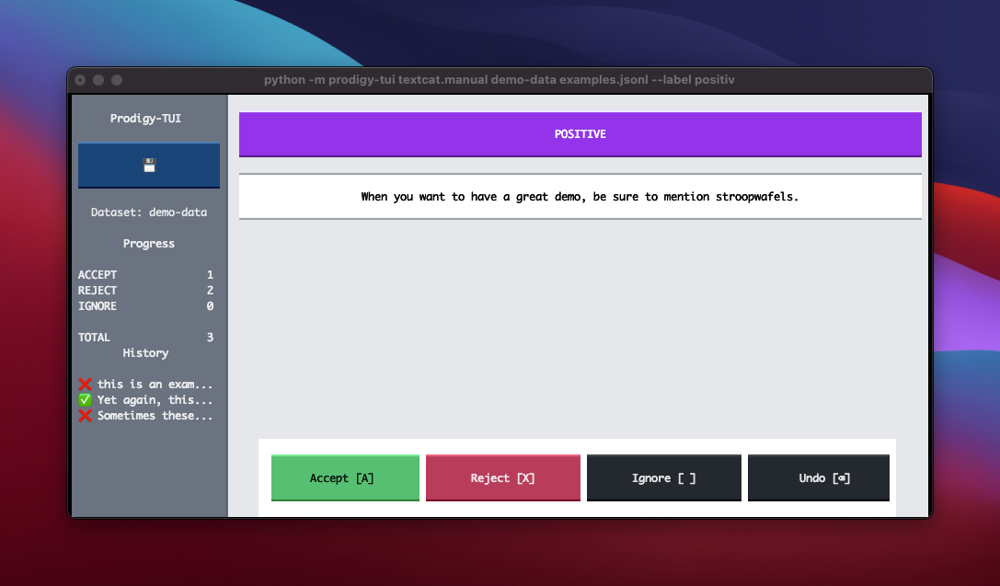

# prodigy-tui

A TUI for [Prodigy](https://prodi.gy/), made with [Textual](https://textual.textualize.io/). 



This project is currently mainly meant as a demo. Partially because doing annotations via the terminal is relatively experimental, but also because I cannot guarantee full feature parity with Prodigy just yet. The only implemented interface right now is `textcat.manual` but I may implement more in the future. 

That said, this tool _does_ integrate with Prodigy. For example, when you run this:

```
> python -m prodigy-tui textcat.manual --help 
```

You're going to get a very familiar help text. 

```
usage: textcat.manual [-h] [--label LABEL] dataset source

Interface for binary text classification from the terminal!

positional arguments:
  dataset               dataset to write annotations into (str)
  source                path to text source (Path)

optional arguments:
  -h, --help            show this help message and exit
  --label LABEL, -l LABEL
                        category label to apply, only binary is supported (str)
```

To start annotating binary text examples, you can run something like: 

```
prodigy-tui textcat.manual reddit-data examples.jsonl --label positive
```

And this will start saving annotations into the `reddit-data` dataset. 

## Installation 

You will need to install this tool in an environment that already has Prodi.gy installed. Given such an environment, you can use pip. 

```
python -m pip install prodigy-tui
```

To get the latest from Github, you can also use:

```
python -m pip install "prodigy-tui @ git+https://github.com/koaning/prodigy-tui.git"
```

## Features 

- Works over SSH, no need to share a browser. 
- Keyboard shortcuts are the same. 
- You could even click the buttons if you really wanted to though. 

## Feedback

As mentioned before, this is a bit of an experiment. But it seems interesting to explore. Maybe data annotation is something that _can_ happen via the terminal and maybe there's something that's very developer friendly about that.

## Shoutout 

Props to the folks over at [textualize](https://www.textualize.io/). Much of the heavy lifting in UI-land is handled by their stack. 
